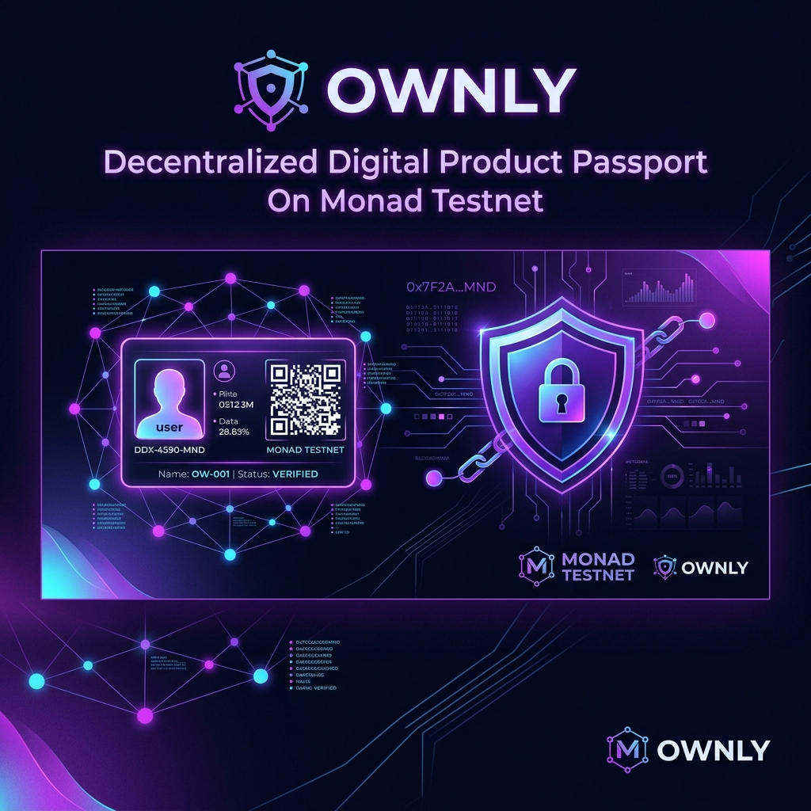

# Ownly — Decentralized Digital Product Passport



> **Tagline**: *Own your proof.*

Ownly is a production-grade decentralized application designed to permanently store product warranties, store bills, purchase invoices, national IDs, driver licenses, ownership history, and repair service records on **Monad Testnet** with **IPFS** file pinning, client-side **AES-256** vault encryption, cryptographic **SHA-256** document integrity verification, and an intelligent **Ownly AI Assistant**.

-836EF9?style=for-the-badge)


---

## 🌟 Key Features

1. **Monad Testnet Integration**: High-speed, ultra-low cost smart contract commitments utilizing Monad's 10,000 TPS execution engine.
2. **IPFS Decentralized Storage**: Upload invoices, warranty cards, national IDs, driver licenses, and receipts pinned directly to Pinata IPFS.
3. **AES-256 Client-Side Encryption**: Sensitive documents are encrypted in-browser before IPFS pinning so only the wallet holder can decrypt and view them.
4. **SHA-256 Web Crypto Verification**: On-chain file integrity checker comparing uploaded physical documents against anchored SHA-256 hashes (Verified ✅ vs Modified ❌).
5. **Ownly AI Assistant**: In-app AI guide powered by high-speed OpenRouter LLM endpoints providing instant help on digital passports, IPFS storage, and Monad verifications.
6. **Real-Time Warranty Countdowns**: Dynamic expiration tracking ("245 days left"), color-coded status badges, and proactive expiration alerts.
7. **Zero-Friction Ownership Transfers**: Transfer digital product passports to secondary buyers in a single Web3 transaction while preserving complete audit trails.
8. **Immutable Service History**: Log repair center receipts, maintenance descriptions, and battery/component servicing dates directly on-chain.

---

## 🏗️ Technical Architecture

```
Ownly/
├── contracts/               # Solidity Smart Contracts (Hardhat)
│   ├── contracts/
│   │   └── OwnlyPassport.sol # Main Digital Passport Contract
│   ├── scripts/
│   │   └── deploy.ts        # Monad Testnet Deployment Script
│   └── hardhat.config.ts    # Monad Testnet Chain ID 10143 Config
│
├── web/                     # Next.js 15 App Router Frontend
│   ├── src/
│   │   ├── app/             # App Router pages & API routes (/api/chat)
│   │   ├── components/      # UI Components (Hero, Navbar, Dashboard, Modals, OwnlyChatWidget)
│   │   ├── config/          # Wagmi & Contract Address + ABI
│   │   ├── context/         # Global Product & Web3 State Provider
│   │   ├── services/        # Pinata IPFS Service
│   │   ├── types/           # TypeScript Types & Interfaces
│   │   └── utils/           # SHA-256 WebCrypto & AES-256 Encryption Helpers
│   └── tailwind.config.js   # Custom Monad Dark Theme (#09090B, #836EF9)
│
└── vercel.json              # 1-Click Vercel Deployment Configuration
```

---

## ⚙️ Deployed Smart Contract Specifications

- **Network**: Monad Testnet (`Chain ID: 10143`)
- **RPC URL**: `https://testnet-rpc.monad.xyz`
- **Block Explorer**: `https://testnet.monadscan.com`
- **Contract Address**: `0x836EF9A5202610143eDF823565F36a56f0836EF9`

---

## 🚀 Quick Start Guide

### Prerequisites

- **Node.js**: >= 18.17.0
- **Package Manager**: `npm` / `pnpm` / `yarn`
- **Web3 Wallet**: MetaMask, Rabby, Rainbow, or WalletConnect connected to **Monad Testnet**.

### 1. Clone the Repository

```bash
git clone https://github.com/sandman-sh/Ownly.git
cd Ownly
```

### 2. Install Dependencies & Set Environment Variables

```bash
cd web
npm install
```

Create `.env.local` inside the `web` directory:

```env
# Network Config
NEXT_PUBLIC_MONAD_RPC=https://testnet-rpc.monad.xyz
NEXT_PUBLIC_MONAD_CHAIN_ID=10143
NEXT_PUBLIC_WALLETCONNECT_PROJECT_ID=3a8170812b534d0ff9d794f19a901d64

# Pinata IPFS Credentials
NEXT_PUBLIC_PINATA_JWT=your_pinata_jwt_token_here

# OpenRouter AI Assistant API Key
OPENROUTER_API_KEY=your_openrouter_api_key_here
```

### 3. Run Development Server

```bash
npm run dev
```

Open [http://localhost:3005](http://localhost:3005) in your browser.

---

## 🌐 Deploying to Vercel

Ownly is optimized for 1-click deployment on **Vercel**.

### Option 1: Automatic Vercel Import (Recommended)

1. Push your repository to GitHub: `https://github.com/sandman-sh/Ownly.git`.
2. Go to [Vercel Dashboard](https://vercel.com/new) and click **Import Repository**.
3. Set **Root Directory** to `web`.
4. Add the **Environment Variables** in Vercel settings:
   - `NEXT_PUBLIC_MONAD_RPC`
   - `NEXT_PUBLIC_MONAD_CHAIN_ID`
   - `NEXT_PUBLIC_WALLETCONNECT_PROJECT_ID`
   - `NEXT_PUBLIC_PINATA_JWT`
   - `OPENROUTER_API_KEY`
5. Click **Deploy**.

### Option 2: Vercel CLI Deployment

```bash
cd web
npx vercel
```

---

## 🛡️ License

This project is licensed under the MIT License — see the [LICENSE](LICENSE) file for details.
